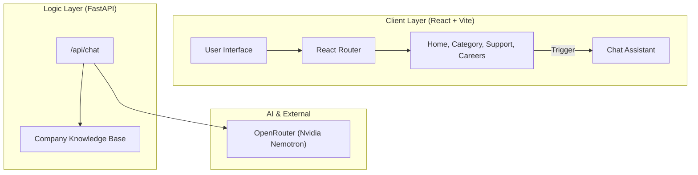

# Appasamy Associates - AI-Enhanced Multi-Page Catalog

A modern, high-performance web application for Appasamy Associates, featuring a comprehensive product catalog, dedicated support and careers pages, and an integrated AI Assistant powered by OpenRouter (Nvidia Nemotron).

## 🚀 Key Features

- **Multi-Page Architecture**: Seamless navigation between Home, Products, Support, and Careers using `react-router-dom`.
- **AI Assistant**: A context-aware chatbot that knows the entire Appasamy catalog and handles inquiries, WhatsApp routing, and email drafting.
- **Dynamic Product Catalog**: Scraped and structured data for all major divisions:
  - Micro Surgical Instruments
  - Surgical & IOL Systems
  - Laser & Therapeutic Devices
  - Ophthalmology & Optometry
  - Ultrasound Scanners
  - Pharmaceuticals
  - Industry Partners (Canon, Reichert, etc.)
- **Professional Design**: Premium aesthetics with smooth animations using `framer-motion` and `lucide-react` icons.
- **CI/CD Ready**: Integrated GitHub Actions for automated testing on Node 24.

## 🛠️ Tech Stack

- **Frontend**: React, Vite, Framer Motion, Lucide React, React Router.
- **Backend**: FastAPI (Python), OpenRouter API.
- **Deployment**: Vercel (Frontend + Backend Monorepo), GitHub Actions (CI).

## 🏗️ Architecture



## 💻 Local Development

### 1. Backend Setup
```bash
cd backend
pip install -r requirements.txt
# Create a .env file with your OPENROUTER_API_KEY
uvicorn main:app --reload --port 8001
```

### 2. Frontend Setup
```bash
npm install
npm run dev
```

## 🌐 Deployment

This project is configured for **Vercel** monorepo deployment:
1. Connect your GitHub repo to Vercel.
2. Add `OPENROUTER_API_KEY` to Environment Variables.
3. Set `VITE_API_URL` to `/api`.
4. Vercel will use the `vercel.json` configuration to route and build both services.

---
*Created with ❤️ for Appasamy Associates.*
